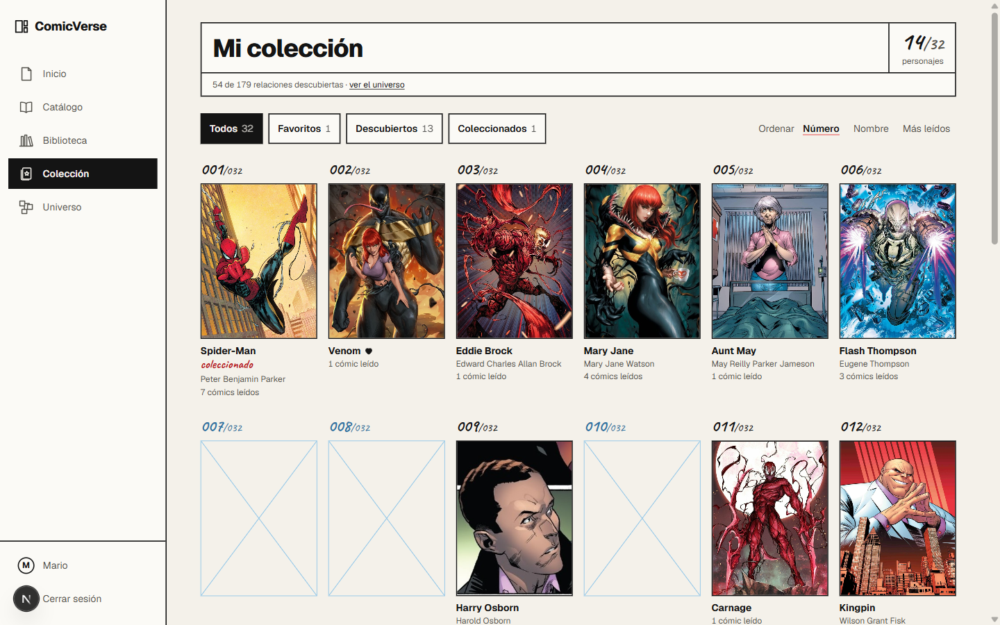
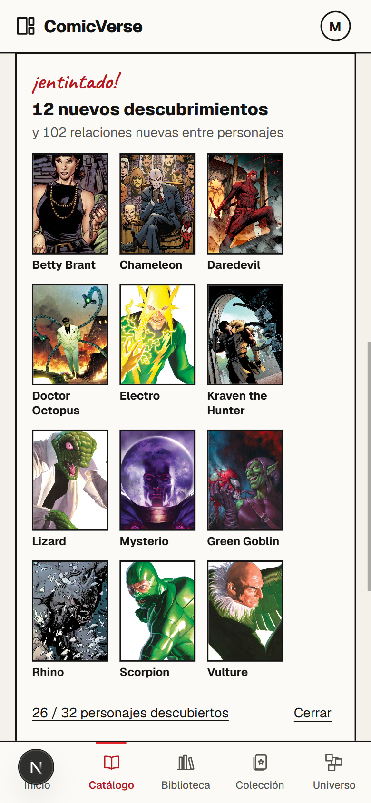
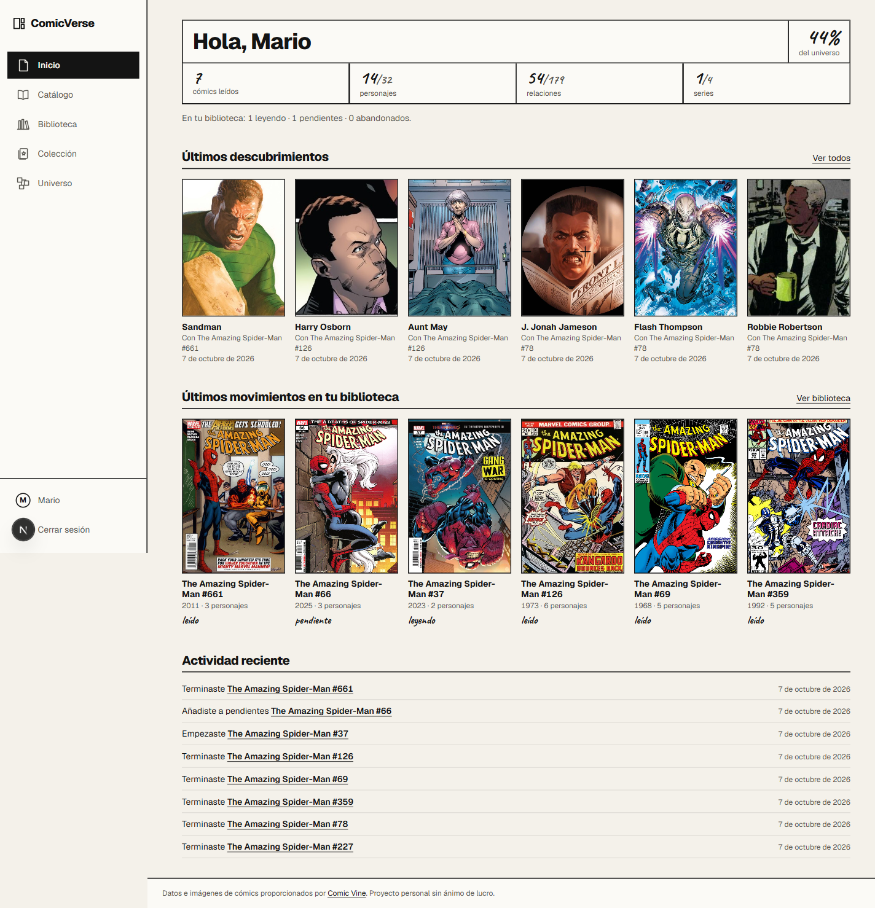
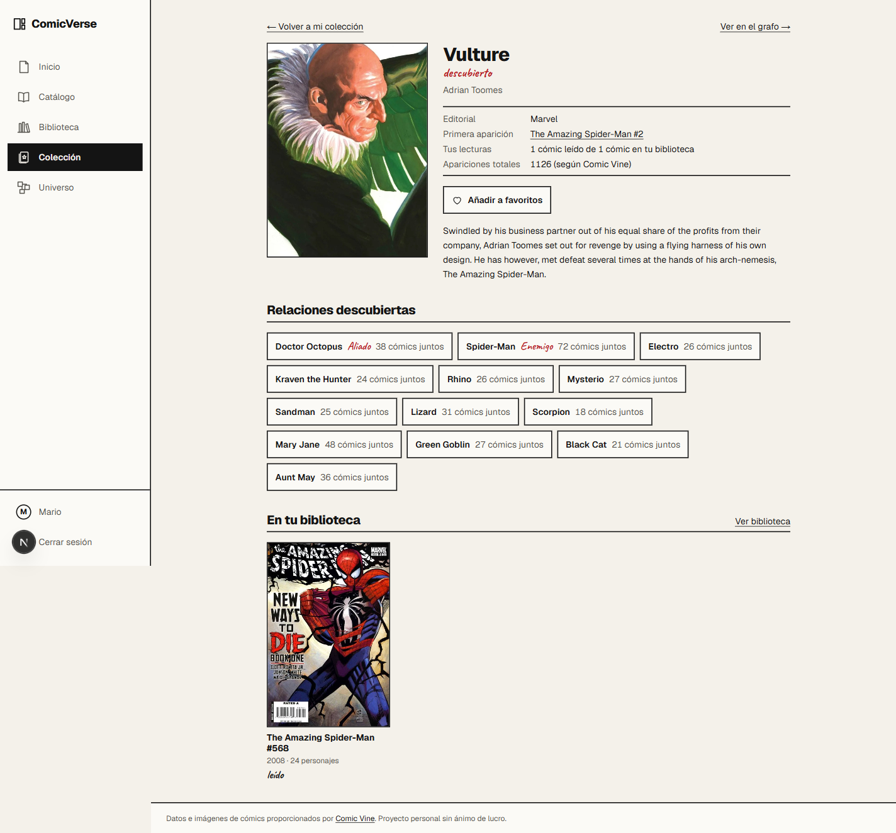

# ComicVerse

**Descubre el universo de los cómics mientras lo lees.** ComicVerse es una biblioteca personal de cómics en la que cada lectura desbloquea a los personajes que aparecen en ella y las relaciones entre ellos. Tu colección empieza «a lápiz» y se va entintando a medida que lees.

> **Demo:** [comicverse-eight.vercel.app](https://comicverse-eight.vercel.app) (Vercel + Neon). Crea una cuenta y marca un cómic como leído.



## Qué hace

- **Zonas Marvel y DC:** un selector cambia toda la app de editorial. Marvel se pinta en rojo y DC en azul, y cada zona tiene su propio catálogo, biblioteca, colección, universo y progreso.
- **Cualquier cómic:** el catálogo parte de un universo semilla (Spider-Man). Si buscas una serie que no está (*Daredevil*, *Absolute Green Lantern*…), se busca en Comic Vine y se añade con un clic, con todos sus cómics. Sus personajes se traen al abrir cada cómic.
- **Novedades automáticas:** un cron diario de Vercel trae los cómics de Marvel y DC publicados en los últimos días (las series nuevas entran enteras).
- **Biblioteca personal** por estados (Pendiente, Leyendo, Leído, Abandonado), con puntuación, favoritos, reseñas privadas e historial de cambios.
- **Desbloqueo de personajes:** al marcar un cómic como leído se descubren sus personajes (y se completa su ficha desde Comic Vine). Al leer 5 cómics de un mismo personaje, este pasa a estar *coleccionado*. Si desmarcas un cómic, los personajes que solo aparecían en él vuelven a estar por descubrir.
- **Colección en álbumes:** en cada zona, un álbum por cada serie de tu biblioteca, con sus cromos numerados por orden de aparición y huecos a lápiz para los que faltan.
- **Sin spoilers:** de un personaje que aún no has descubierto, al navegador solo le llega su número en el álbum. No le llegan ni su nombre, ni su imagen, ni su id. Su ficha devuelve el mismo 404 que un personaje inexistente.
- **Relaciones:** las relaciones curadas (aliado, enemigo, familia, pareja…) se combinan con relaciones derivadas de las coapariciones. Una relación se descubre cuando conoces a los dos personajes.
- **Universo:** un grafo interactivo de tus descubrimientos (React Flow), una vista centrada en un personaje y una vista en lista accesible.
- **Inicio:** tu progreso (porcentaje del universo, personajes, relaciones y series), los últimos descubrimientos y tu actividad reciente.
- **Diseño responsive real:** barra lateral en escritorio, iconos en tableta y barra inferior en el móvil.

| Desbloqueo al marcar como leído | Inicio |
|---|---|
|  |  |

## Stack

| Capa | Tecnología |
|---|---|
| Framework | Next.js 16 (App Router, Turbopack), React 19, TypeScript estricto |
| Estilos | Tailwind CSS v4, con un sistema de diseño propio («Página de arte original», ver [`DESIGN.md`](DESIGN.md)) |
| Base de datos | PostgreSQL 17 (Docker en local) |
| ORM | Prisma 7 con `@prisma/adapter-pg` |
| Autenticación | Better Auth (email y contraseña, sesiones en BD) |
| Validación | Zod 4, compartida entre cliente y servidor |
| Grafo | React Flow y `d3-force` para la distribución de los nodos |
| Tests | Vitest: 124 tests unitarios y 65 de integración contra PostgreSQL real |
| Tareas programadas | Vercel Cron (novedades diarias) |

## Arquitectura

Es un monolito modular en una sola app de Next.js. El código de servidor vive en `src/server/` y no importa nada de React.

```
Cliente (React)
   │  HTTP JSON /api/v1/...    (las páginas de servidor llaman a los servicios directamente)
Route handlers ── sesión · validación Zod · códigos HTTP
   │
Servicios ── reglas de negocio y transacciones
   │                    │
Dominio (puro,          Repositorios (Prisma) ──► PostgreSQL
sin BD ni HTTP)
   │
Integraciones ── cliente de Comic Vine
```

Decisiones de diseño destacadas:

- **Los desbloqueos se calculan, no se guardan.** «Desbloqueado» es una consulta indexada: personajes coleccionables que aparecen en cómics leídos por el usuario. La definición está en un único sitio, `unlockedBy(userId)`. Así no hay una segunda copia del estado que se pueda desincronizar, ni carreras entre peticiones simultáneas. Solo se guarda lo que no se puede calcular: favoritos y el registro histórico de descubrimientos.
- **Los DTO deciden qué sale hacia el navegador.** Ahí se aplica la regla de spoilers, con tests que garantizan que un personaje bloqueado no expone más que su número.
- **Los servicios reciben el cliente de base de datos como parámetro**, lo que permite ejecutar los tests de integración contra una base de datos de pruebas real.
- **Relaciones derivadas con el coeficiente de Ochiai.** Una pareja se considera relacionada si comparte al menos 5 cómics y su coeficiente es ≥ 0,2. Con solo «≥ 5 cómics compartidos», los personajes omnipresentes quedaban conectados con todos.
- **Importación idempotente y bajo demanda.** El universo semilla se describe en [`data/universe.json`](data/universe.json), solo con ids verificados. Todo se guarda con `upsert` por `(fuente, id externo)`, así que repetir una importación no duplica nada. La web solo llama a Comic Vine cuando hace falta algo nuevo: buscar o añadir una serie, los personajes de un cómic la primera vez que se abre y las novedades diarias. Comic Vine permite unas 200 peticiones por hora, por eso las editoriales de las series desconocidas se consultan en bloque (100 por petición).

## Puesta en marcha

Requisitos: Node 24, npm, Docker Desktop y una [clave gratuita de Comic Vine](https://comicvine.gamespot.com/api/) (para importar datos y para la búsqueda en Comic Vine desde la web).

```bash
git clone https://github.com/MarioGuerra71/comicverse.git
cd comicverse
cp .env.example .env          # rellena BETTER_AUTH_SECRET y COMIC_VINE_API_KEY
docker compose up -d          # PostgreSQL en el puerto 5432
npm install
npx prisma generate
npx prisma migrate deploy
npm run universe:import       # importa series, cómics y personajes (tarda unos minutos por el límite de la API)
npm run relationships:import  # relaciones curadas (no usa Comic Vine)
npm run dev                   # http://localhost:3000
```

Para generar `BETTER_AUTH_SECRET`:

```bash
node -e "console.log(require('crypto').randomBytes(32).toString('base64'))"
```

### Variables de entorno

| Variable | Uso |
|---|---|
| `DATABASE_URL` | Conexión a PostgreSQL |
| `BETTER_AUTH_SECRET` | Secreto de sesiones (≥ 32 caracteres, distinto en cada entorno) |
| `BETTER_AUTH_URL` | URL pública de la app (`http://localhost:3000` en local). En Vercel no hace falta: se usa el dominio de producción del proyecto |
| `COMIC_VINE_API_KEY` | Clave de Comic Vine. Solo la usa el servidor: búsqueda e importación de series, personajes y novedades |
| `CRON_SECRET` | Secreto con el que Vercel Cron llama a la tarea diaria de novedades |

Las variables se validan al arrancar. `.env` no se versiona.

### Scripts

| Comando | Qué hace |
|---|---|
| `npm run dev` / `build` / `start` | Desarrollo, compilación y producción |
| `npm test` | Tests unitarios |
| `npm run test:integration` | Tests contra la base de datos `comicverse_test` (necesita Docker) |
| `npm run typecheck` / `lint` | TypeScript y ESLint |
| `npm run universe:import` | Importar el universo de `data/universe.json` desde Comic Vine |
| `npm run universe:resolve` | Buscar y verificar ids de Comic Vine antes de ampliar el universo |
| `npm run relationships:import` | Cargar las relaciones curadas de `data/relationships.json` |
| `npm run releases:sync -- 3` | Traer las novedades de Marvel y DC de los últimos 3 días (en producción lo hace un cron diario de Vercel) |
| `npm run characters:images` | Aplicar las imágenes de personajes elegidas a mano en `data/character-images.json` |

## API

Todas las rutas de `/api/v1` requieren sesión y filtran siempre por el usuario de la sesión. Los errores tienen la forma `{ error: "CODIGO" }` y la paginación `{ items, page, pageSize, total, totalPages }`.

| Ruta | Descripción |
|---|---|
| `GET /comics` | Catálogo con búsqueda, filtro por serie y editorial (`publisher=marvel\|dc`), orden y paginación |
| `POST /series/import` | Añade al catálogo una serie de Comic Vine con todos sus cómics |
| `GET /library` | Biblioteca propia con contadores por estado |
| `GET/PUT/PATCH/DELETE /library/comics/:id` | Estado, puntuación y favorito de un cómic. Al cambiar el estado se devuelve el resultado del desbloqueo |
| `GET/PUT/DELETE /library/comics/:id/review` | Reseña privada (solo en cómics leídos) |
| `GET /collection` | Personajes desbloqueados y, de los bloqueados, solo su número |
| `PATCH /collection/characters/:id/favorite` | Personaje favorito |
| `GET /characters/:id` | Ficha de un personaje desbloqueado (un bloqueado devuelve 404) |
| `GET /graph` | Grafo del universo descubierto, con vista opcional centrada en un personaje |
| `GET /dashboard` · `GET /discoveries` | Progreso, actividad y registro de descubrimientos |

Las rutas de biblioteca, inicio, universo y descubrimientos responden por la zona elegida (cookie `cv-zone`). `GET /api/cron/new-releases` es la tarea diaria y solo acepta `Authorization: Bearer $CRON_SECRET`.

## Seguridad

- **Entradas:** todas se validan con Zod, el `userId` sale siempre de la sesión y las salidas pasan por DTO explícitos.
- **Contraseñas:** las cifra Better Auth. Hay límite de intentos persistido en la base de datos (3 cada 10 s al entrar o registrarse).
- **CSRF:** cookies `SameSite=Lax` y comprobación de `Origin` y `Sec-Fetch-Site` en toda escritura a la API.
- **CSP con nonce** en cada página (`strict-dynamic`, `frame-ancestors 'none'`, `object-src 'none'`), además de cabeceras HSTS, `X-Content-Type-Options`, `Referrer-Policy`, `X-Frame-Options` y `Permissions-Policy`.
- **Secretos:** solo en variables de entorno. La clave de Comic Vine nunca llega al navegador y los errores del cliente de Comic Vine no incluyen la URL (que la contiene).
- **Errores:** la pantalla de error no muestra mensajes internos.
- **`npm audit`:** los avisos conocidos (`deepmerge-ts`, `mysql2`, `braces`) vienen de herramientas de desarrollo (la CLI de Prisma 7 y ESLint), no del código que recibe datos de usuarios.

## Calidad

- **Tests unitarios** de dominio, DTO, validación, mappers y del cliente de Comic Vine (con `fetch` y tiempos inyectados, sin red).
- **Tests de integración** contra PostgreSQL real: desbloqueos, relecturas, peticiones concurrentes, desmarcar con personajes compartidos y otros casos.
- **Lighthouse** (build de producción, móvil): accesibilidad 100 en todas las pantallas. El LCP del catálogo es de 0,69 s con 4G y CPU ×4.

## Hoja de ruta

- Rediseñar a fondo la vista del grafo.
- Logros y funciones sociales (seguir usuarios, listas públicas, comparar colecciones).
- IA opcional (búsqueda en lenguaje natural y recomendaciones), siempre construida con los mismos DTO para no revelar spoilers.

## Créditos y licencia de datos

Datos e imágenes de cómics proporcionados por [Comic Vine](https://comicvine.gamespot.com/). Las imágenes se enlazan desde su CDN y no se redistribuyen. Es un proyecto personal sin ánimo de lucro, sin relación con Marvel, DC ni Comic Vine; no usa sus logotipos ni sus tipografías.


